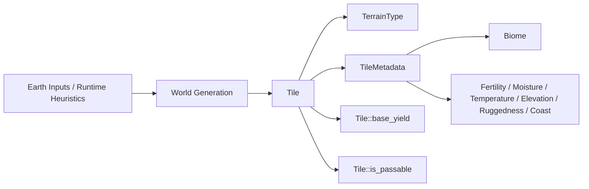
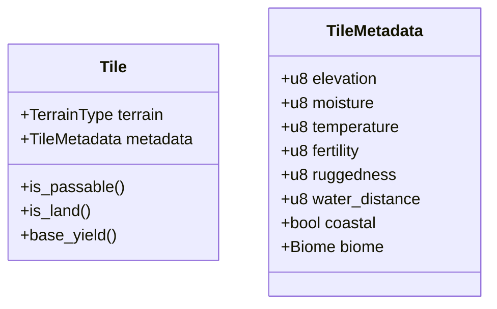
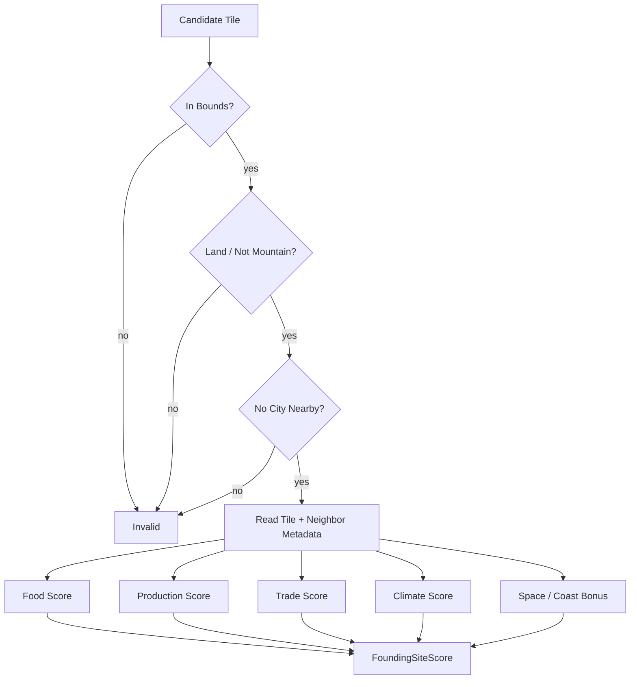
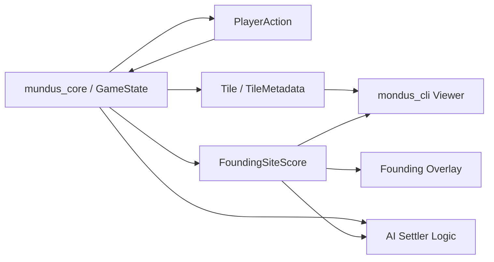

# Strategic Simulation Architecture

This document tracks the current gameplay-side architecture for the world map.
It should be updated when the tile model, founding rules, city economy, or
viewer contracts change.

## Scope

This document covers:

- simulation tile data in `mundus_core`
- city founding suitability
- the contract between `mundus_core` and `mundus_cli`

It does not cover:

- render tile baking internals
- Earth source ingestion details
- future server or persistence architecture

## Current model

The world map is driven by simulation tiles, not by the rendered Earth image.

## Tile contract

`Tile` is the gameplay-facing terrain object.

- `terrain` is the coarse rule category.
- `metadata` carries richer simulation signals.
- `Tile` methods expose gameplay contracts such as passability and base yield.

## Founding suitability

City founding uses a reusable site-scoring function in `mundus_core::site`.

The scoring function answers two questions:

1. Is the tile valid for founding?
2. If valid, how desirable is it?

## Separation of concerns

`mundus_core` owns:

- tile and metadata generation
- founding rules
- founding mutation from settler to city
- economy rules
- city and unit state
- AI use of gameplay scoring contracts

`mundus_cli` owns:

- camera and selection state
- map rendering
- viewer panels
- displaying tile/founding diagnostics
- overlay visualizations derived from core scores

## Current follow-up work

- tune and extend the desirability overlay in the viewer
- use metadata more aggressively in city economy and placement
- move stable Earth simulation metadata to offline bake once the schema settles
